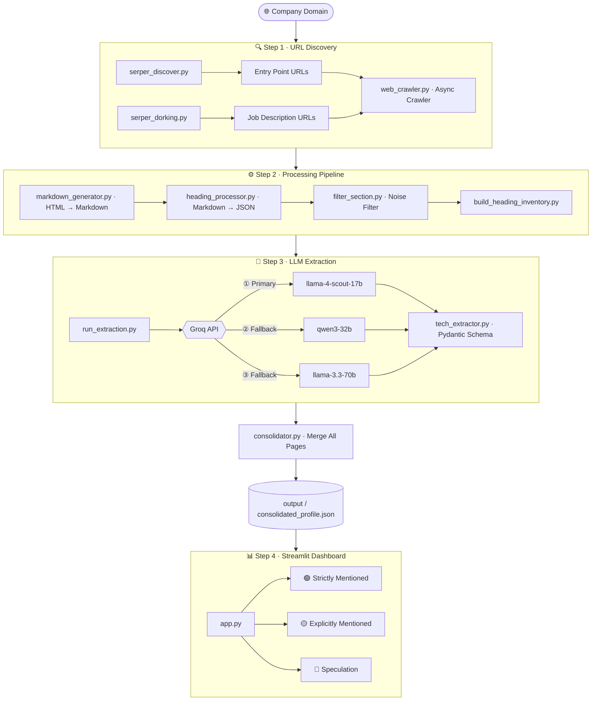

# 🤖 AI Tech Stack Discovery Engine

A fully automated data scraping and intelligence pipeline that discovers, extracts, and visualizes the **entire technology ecosystem** of any company from their public web presence using LLMs.

## ✨ Features

- **Smart URL Discovery** — Uses Serper API to find all company-owned pages
- **Google Dorking** — Finds job descriptions from LinkedIn & Naukri for deeper tech signal
- **Async Web Crawler** — Concurrent crawling with `crawl4ai`, with file-level caching
- **Markdown-based Pipeline** — Converts raw HTML → Markdown → Structured JSON sections
- **LLM Extraction** — Groq-powered extraction with automatic model fallback on rate limits
- **Streamlit Dashboard** — Dark-mode UI with real-time terminal streaming and interactive tables

## 🏗️ Architecture



---

## 🧱 Architecture Design Decisions

- **Markdown as Intermediate Format** — Instead of parsing raw HTML, all pages are first converted to Markdown. This gives a clean, structured plain-text representation that is both human-readable and LLM-friendly
- **Page-per-File Storage** — Each crawled page is saved as a separate `.md` file rather than one big blob. This allows selective reprocessing, easy inspection, and per-file caching
- **Section-Level Granularity** — Processing at the `{ heading, content }` section level (not full-page level) gives the filters precise surgical control over what gets sent to the LLM
- **Filter Before LLM** — All noise removal happens before any LLM call. The LLM only ever sees pre-qualified, signal-rich content — never raw boilerplate
- **Per-Page LLM Extraction** — Each page is extracted independently instead of batching. This avoids context window overflows and produces cleaner, more traceable per-source evidence
- **Fallback Model Queue** — Instead of a single model, a priority-ordered queue of Groq models is used. On any `429` rate limit error, the pipeline instantly switches to the next model without interruption
- **Consolidation as a Separate Step** — Merging results is decoupled from extraction, so you can re-run only the consolidation step without re-hitting the LLM API

---

## 🔄 Execution Flow

1. **URL Discovery** — Serper API finds all company-owned pages; Google Dorking pulls job postings from LinkedIn & Naukri
2. **Deduplication** — All URLs are merged, filtered to company domain only, and saved
3. **Async Crawling** — Pages are crawled concurrently (10 at a time) and saved as Markdown; already-crawled files are skipped
4. **Section Splitting** — Markdown is split into `{ heading, content }` chunks by `#` headings
5. **Noise Filtering** — Short sections, repeated boilerplate, and duplicate content are removed
6. **LLM Extraction** — Surviving sections are sent to Groq; structured JSON is extracted using a Pydantic schema
7. **Consolidation** — All per-page results are merged into one unified `consolidated_profile.json`

## 🧹 Token Reduction Strategy

Raw Markdown is heavily preprocessed before reaching the LLM to cut costs and improve quality:

- **HTML → Markdown** stripes all JS, CSS and layout noise (~60–70% size reduction)
- **Short section filter** removes navigation links, empty headings, and button-only sections
- **High-frequency filter** removes boilerplate headings that appear on >X% of all pages (e.g. "Contact Us", "Get a Demo")
- **Duplicate filter** removes sections with identical body text repeated across pages (e.g. site-wide footers)
- **Result on `crestdata.ai`:** 9,073 raw sections → 1,139 sections — an **87% reduction** before a single token hits the LLM

---


```
Data_scrapper_v2/
├── app.py                  # Streamlit frontend
├── main.py                 # Pipeline entrypoint (CLI & UI)
├── requirements.txt
└── utils/
    ├── serper_discover.py       # Company URL discovery via Serper
    ├── serper_dorking.py        # LinkedIn/Naukri job description dorking
    ├── web_crawler.py           # Async URL crawler & deduplicator
    ├── markdown_generator.py    # HTML → Markdown converter (with caching)
    ├── heading_processor.py     # Markdown → structured JSON sections
    ├── filter_section.py        # Noise filtering (short, duplicate, frequent)
    ├── build_heading_inventory.py
    ├── run_extraction.py        # LLM extraction with Groq fallback queue
    ├── tech_extractor.py        # Pydantic schema for structured output
    └── consolidator.py          # Merges per-page JSON into master profile
```

## 🚀 Setup

### 1. Clone the repo
```bash
git clone https://github.com/himanesh21/tech_stack_analyzer.git
cd Data_scrapper_v2
```

### 2. Install dependencies
```bash
pip install -r requirements.txt
```

### 3. Configure API keys
Create a `.env` file in the utils folder:
```
SERPER_API_KEY=your_serper_api_key
GROQ_API_KEY=your_groq_api_key
```

### 4. Run the Streamlit UI
```bash
streamlit run app.py
```

### 5. Or run via CLI
```bash
python main.py --domain crestdata.ai
```

## 🧠 LLM Model Fallback Queue

The pipeline uses Groq with the following priority order (auto-switches on 429 rate limits):
1. `meta-llama/llama-4-scout-17b-16e-instruct` ← Primary
2. `qwen/qwen3-32b`
3. `qwen/qwen3.6-27b`
4. `llama-3.3-70b-versatile`
5. `openai/gpt-oss-120b`

## 📊 Output

The final output is saved to `output/{company_name}_consolidated_profile.json` with three confidence tiers:
- 🟢 **Strictly Mentioned** — Explicitly stated in company documentation
- 🟡 **Explicitly Mentioned** — Strongly implied through technical context or job postings
- 🔴 **Speculation** — Inferred from indirect references
